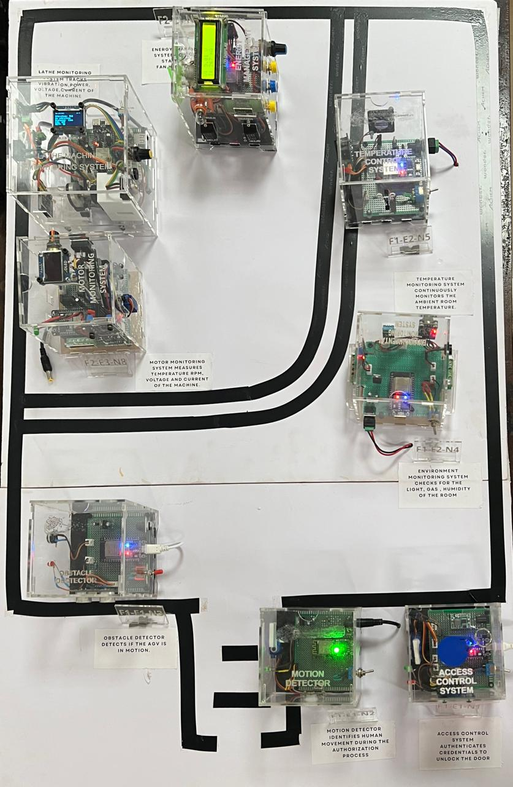
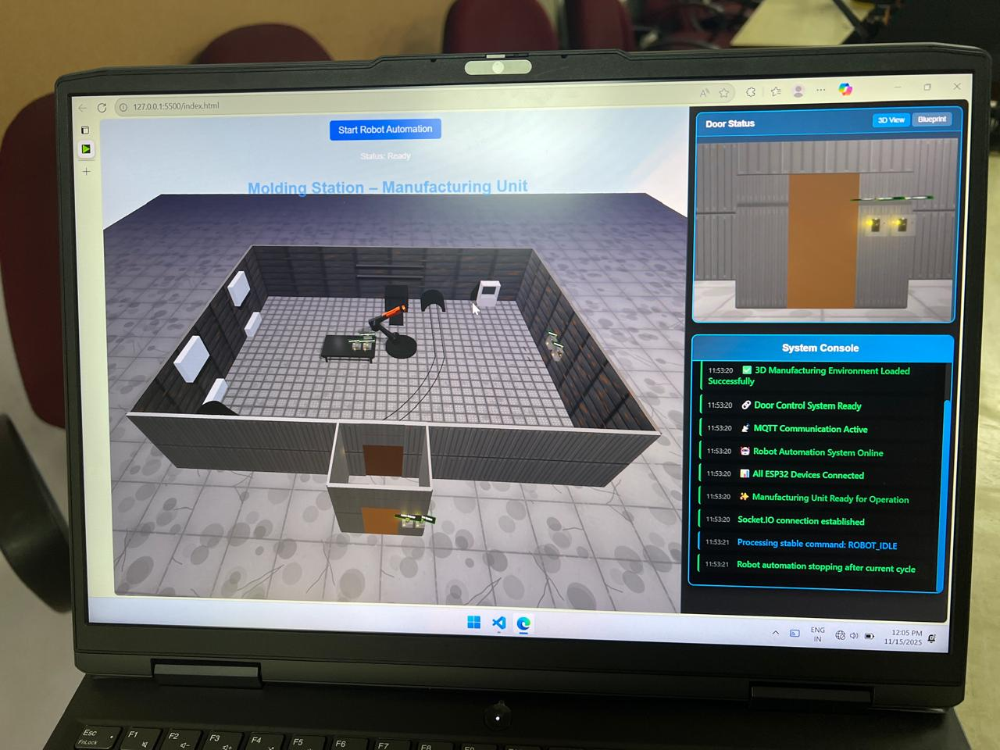

# The Smart Molding Station

  
  

### **Industry 4.0 Cyber-Physical System (CPS) Prototype**

The **Smart Molding Station** is a 4-tier distributed IoT architecture designed to simulate the safety and operational logic of a modern manufacturing cell. By integrating 8 wireless sensor nodes with a synchronized **3D Digital Twin**, the system enforces context-aware safety protocols to protect workers in high-temperature environments.

---

## System Architecture
The project utilizes a hierarchical 4-tier network to reduce latency and enhance reliability:

* **Tier 1: Physical Layer** – 8x Microcontrollers (ESP32/ESP8266) acting as hardware proxies for machinery (Lathe, Robot, AGV).
* **Tier 2: Edge Layer** – 3x Raspberry Pi 5 gateways for local data ingestion and protocol translation.
* **Tier 3: Fog Layer** – 2x Raspberry Pi 5s managing "East-West" logic and safety interlock coordination.
* **Tier 4: Cloud Layer** – 1x Raspberry Pi 5 hosting the **ThingsBoard HMI** and the **3D Digital Twin** web server.

---

## Key Features
* **Context-Aware Safety:** A "Dual-Door" entry sequence that validates RFID credentials and PIR motion sensing simultaneously.
* **Hazardous State Interlock:** Entry is automatically disabled if the system detects:
    * **AGV Transit:** Ultrasonic sensor detects movement in the path.
    * **Active Machinery:** High current draw from the Robotic Arm or Lathe.
    * **Critical Heat:** Furnace temperature exceeds safe operational limits.
* **Bi-Directional Digital Twin:** A web-based 3D visualization that mirrors physical state and can "lock" the physical factory floor until virtual simulations are complete.

---

## Hardware & Tech Stack
* **Microcontrollers:** ESP32, ESP32-C6, ESP8266
* **Sensing:** RFID (RC522), Current (INA219), Vibration (Piezo), Distance (HC-SR04), Temp (LM35/DHT11)
* **Communication:** MQTT (Mosquitto) over a private WLAN.
* **Visualization:** ThingsBoard IoT Dashboard & Three.js (WebGL) for the Digital Twin.

---

## Operational Logic
The system uses a unique **Simulation-Based Safety Interlock**. When an AGV cycle begins, the 3D model triggers an animation. The physical doors remain electronically locked until the 3D model confirms the virtual path is 100% clear, ensuring a fail-safe feedback loop between digital and physical realms.

---

**Developed as an Industry 4.0 research prototype to demonstrate distributed computing and industrial safety.**
